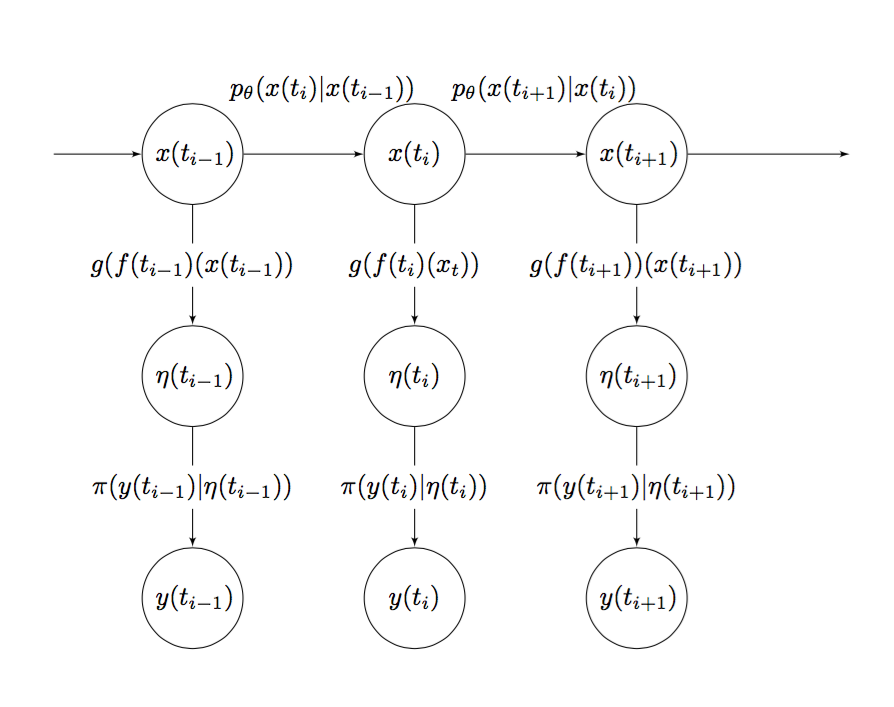
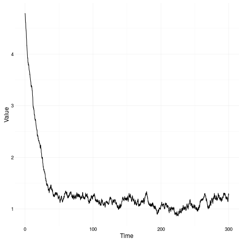
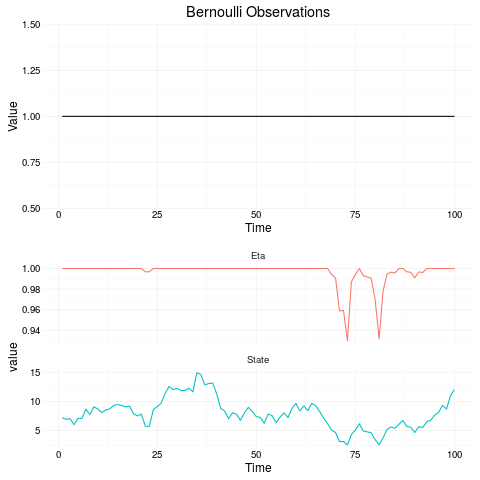
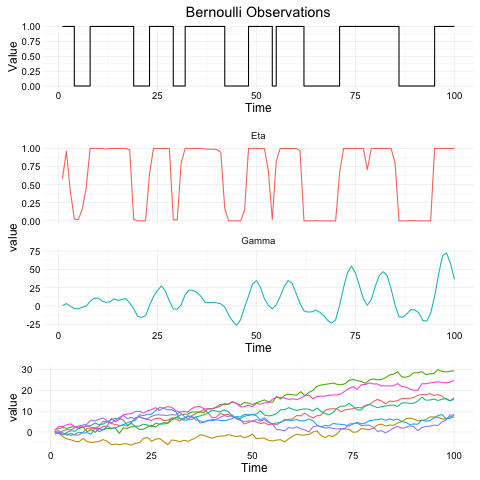
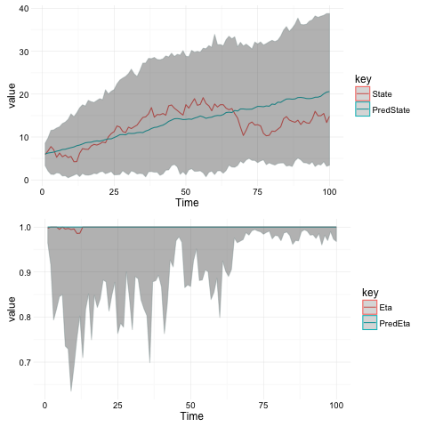

# ComposableStateSpaceModels

This is a Scala library for continuous time partially observed Markov processes (POMP). Partially observed Markov processes can be used to model time series data, allowing interpolation and forecasting. 

Usage
-----

To get started using this library add the following to `build.sbt`

```scala
libraryDependencies += "com.github.jonnylaw" %% "composablestatespacemodels" % "1.0"
```

Introduction to Partially Observed Markov Process Models
--------------------------------------------------------

Partially observed Markov processes are a type of [State Space Model](https://en.wikipedia.org/wiki/State-space_representation). This means the models feature unobserved, or latent, variables. The unobserved system state is governed by a [diffusion process](https://en.wikipedia.org/wiki/Diffusion_process), these are continuous time Markov processes meaning that future values of the state space, are independent from all previous values given the current state, x(t). A representation of a POMP model as a directed acyclical graph is below.



The distribution, p, represents the Markov transition kernel of the state space. The distribution pi, represents the observation distribution, parameterised by the state space. The function f is a linear deterministic function, which can be used to add cyclic seasonal components to the state space. The function g is the linking-function from a [generalised linear model](https://en.wikipedia.org/wiki/Generalized_linear_model), which transforms the state space into the parameter space of the observation model. Define gamma = f(t, x) and eta = g(gamma).

## Simulating the State Space

A typical diffusion process is the [Ornstein-Uhlenbeck process](https://en.wikipedia.org/wiki/Ornstein%E2%80%93Uhlenbeck_process), which can be simulated by specifying the parameters of the process, `theta`, the mean of the process, `alpha` how quickly the process reverts to the mean and `sigma` the noise of the process. Then we must specify an initial state, which is done by drawing from a Gaussian distribution, since the exact solution to the OU process is a Gaussian distribution. Then we pass a `stepFunction` containing the exact solution to the OU process, relying on only the previous value of the realisation (because the process is  Markovian) and the time difference between realisations.

```scala
import model.StateSpace._
import model.State._
import model.OrnsteinParameter
import breeze.stats.distributions.Gaussian
import model.SimData._

val p = OrnsteinParameter(theta = 6.0, alpha = 0.05, sigma = 1.0)
val initialState = LeafState(Vector(Gaussian(6.0, 1.0).draw))

val sims = simSdeStream(initialState, 0.0, 300.0, 1, stepOrnstein(p))
```

Notice, the state space can be multidimensional, and as such is represented by a `Vector`. A single state is represented by a LeafState, this will become clear when considering composition of models. The figure below shows a representation of the Ornstein-Uhlenbeck process with `theta = 6.0, alpha = 0.05, sigma = 1.0`.



## Simulating a Single Model

The observations of a POMP can be from any parameterised distribution. The observation distribution depends on the latent variablesand sometimes on additional parameters not in the system state, such as a scaling parameter representing measurement noise. The most simple model to simulate is the Bernoulli model, the Bernoulli probability mass function (PMF) is simply p when an event occurs and 1-p when an event doesn't occur. If we consider the probability of an event to vary stochastically, then we can represent it within the POMP framework. Firstly select a representation of the state space, we will use the Ornstein-Uhlenbeck process from the previous example, then specify the parameters and the times the process should be observed. There is a `LeafParameter` class which combines the initial State, optional scale parameter and the state space parameters for a single model.

```scala
import model.{LeafParameter, GaussianParameter, OrnsteinParameter}
import model.SimData._
import model.POMP.BinomialModel
import model.StateSpace._

val p = LeafParameter(
  GaussianParameter(6.0, 1.0),
  None,
  OrnsteinParameter(theta = 6.0, alpha = 0.05, sigma = 1.0))
val mod = BernoulliModel(stepOrnstein)

val times = (1 to 100).map(_.toDouble).toList
val sims = simData(times, mod(params))
```



The figure shows, the state space, which varies along the whole real line and the transformed state space, Eta, which varies on (0, 1). The linking function, g, is the [logistic function](https://en.wikipedia.org/wiki/Logistic_function).

## Composing Multiple Models

If we wish to consider more complex process, for instance a Bernoulli model with a seasonal probability, then we have to add deterministic values to the state before applying the observation distribution. The function, f, is a linear deterministic function which can be used to add seasonal factors to the system state. In order to acheive this in a compositional way, we don't need to define a new value for f, we can simple 'add' a seasonal model to the existing Bernoulli model. This will allow the state space to vary seasonally.

Models are represented as a function from `Parameters => Model`, this means models definted unparameterised. A function for combining two unparameterised models is `Model.op`, this function is associative, but not commutative. This is because the function selects the leftmost Model's observation and linking functions. For full details of model composition, consult the wiki page [Model Composition](wiki/Composing-Models). The code snippet below shows how to construct a seasonal Bernoulli model, the observation distribution is Bernoulli, but the probability of an event occuring follows a daily (period T = 24) cycle if we assume observations are made once every hour.

```scala
  val bernoulliParams = LeafParameter(
    GaussianParameter(0.0, 1.0),
    None,
    BrownianParameter(0.1, 0.3))
  val seasonalParams = LeafParameter(
    GaussianParameter(DenseVector(Array.fill(6)(0.0)),
      diag(DenseVector(Array.fill(6)(1.0)))),
    None,
    BrownianParameter(Vector.fill(6)(0.1), Vector.fill(6)(0.4)))

  val params = bernoulliParams |+| seasonalParams
  val mod = Model.op(BernoulliModel(stepBrownian), SeasonalModel(24, 3, stepBrownian))

  val times = (1 to 100).map(_.toDouble).toList
  val sims = simData(times, mod(params))
```



## Statistical Inference: The Particle Filter

If we have a fully specified model, ie the posterior distributions of the parameters given the data so far are available to us, then we can use a bootstrap particle filter (see [Sequential Monte Carlo Methods in Practice](https://www.springer.com/us/book/9780387951461)) to determine the hidden state space of the observations. Consider the simulated Bernoulli model, the parameters are given by:

```scala
val p = LeafParameter(
  GaussianParameter(6.0, 1.0),
  None,
  OrnsteinParameter(theta = 6.0, alpha = 0.05, sigma = 1.0))
```

We can consider the point values of the parameters to be the mean of the posterior parameter distribution. Then the bootstrap particle filter can be applied to the simulated data and the inferred state space can be compared to the previously simulated state space. The data can be read in from a CSV or database, or simulated again. However, since these are stochastic models we can't compare different realisations of the same model. The particle filter is using 1,000 particles.

```scala
  val data = // bernoulli data

  val p = LeafParameter(
    GaussianParameter(6.0, 1.0),
    None,
    OrnsteinParameter(theta = 6.0, alpha = 0.05, sigma = 1.0))
  
  val mod = BernoulliModel(stepOrnstein)

  val filtered = bootstrapPf(1000, data, mod)(p)
```

The figure below shows the actual simulated state, plotted next to the estimate state and 99% [credible intervals](https://en.wikipedia.org/wiki/Credible_interval).



## Inference for the Full Joint Posterior Distribution

Say we have observed a time depending process in the real world, and don't have the parameters available for the model. We wish to carry out inference for the state space and the parameters of the model simultaneously. This framework implements the Particle Marginal Metropolis Hastings (PMMH) Algorithm (see [Doucet et al. 2010](http://www.stats.ox.ac.uk/~doucet/andrieu_doucet_holenstein_PMCMC.pdf)). The likelihood of the state space and parameters given the observations can be determined using a particle filter, then a standard Metropolis-Hastings update step is used to create a Markov Chain representing the full join posterior of the model given the observed real-world process.

Now we can implement the PMMH algorithm for the simulated Bernoulli observations, and determine if the algorithm is able to recover the parameters.

```scala
val data = //bernoulli data

val p = LeafParameter(
  GaussianParameter(6.0, 1.0),
  None,
  OrnsteinParameter(theta = 6.0, alpha = 0.05, sigma = 1.0))

val mod = BernoulliModel(stepOrnstein)

// the marginal log-likelihood
val mll = pfMll(data, mod)(200)

val iterations = 10000

ParticleMetropolis(mll, p, Parameters.perturb(0.1)).
  iters.
  map(s => s.params).
  take(iterations).
  map( p => ByteString(s"$p\n")).
  runWith(FileIO.toFile(new File("BernoulliMCMC.csv")))
```

Note that the algorithm has been initialised at the same parameter values we used to simulate the model, this kind of prior information is not typically known for real world processes, unless similar processes have been extensively studied. 

## Online Monitoring of MCMC

For large, complex models requiring many parameters the MCMC run may take a long time. It is of interest to monitor the MCMC chain to see if it is converging. The function keeps track of the acceptance ratio and the variance of the estimate of the marginal log-likelihood, which can be used to [tune the PMMH algorithm](https://darrenjw.wordpress.com/2014/06/08/tuning-particle-mcmc-algorithms/). As a rule of thumb, 30% acceptance ratio and marginal log-likelihood variance of 1 is ideal for convergence of the MCMC algorithm. In order to monitor the PMMH run for the bernoulli data, we need to modify it as such:

```scala
val iters = ParticleMetropolis(mll, gaussianPerturb(0.5, 0.1)).iters(p)

iters.
  via(monitorStream(1000, 1)).
  runWith(Sink.ignore)

iters.
  map(s => s.params).
  take(iterations).
  map( p => ByteString(s"$p\n")).
  runWith(FileIO.toFile(new File("BernoulliMCMC.csv")))
```

## Running Multiple Chains

We have provided a convenience function to run multiple chains (in parallel) from the same initial starting position, with the same number of iterations and particles. However it can be easily adapted to run multiple chains with different starting parameters, or multiple chains with different number of particles and / or proposal distributions. The main work is done using the [Akka Streams](http://akka.io/) library.


```scala
// initialise the actor system and materializer
import scala.concurrent.ExecutionContext.Implicits.global
implicit val system = ActorSystem("MultipleChains")
implicit val materializer = ActorMaterializer()

// specify the number of iterations, particles and filename prefix
val iterations = 10000
val particles = 200
val fileOut = "TestMCMC"

// Source defines a new stream, this stream is a range from 1 to 4
// if we want to define multiple starting points, we can provide a vector of Parameters to Source
// then map over them in the mapAsync call
Source(1 to 4).
  mapAsync(parallelism = 4){ chain =>
    val iters = ParticleMetropolis(mll(particles), gaussianPerturb(0.1, 0.1)).iters(initParams)

    iters.
      zip(Source(Stream.from(1))).
      map{ case (x, i) => (i, x.params) }.
      take(iterations).
      map{ case (i, p) => ByteString(s"$i, $p\n") }.
      runWith(FileIO.toFile(new File(s"$fileOut-$iterations-$particles-$chain.csv")))
    
    iters.
      via(monitorStream(1000, chain)).
      runWith(Sink.ignore)
  }.
  runWith(Sink.onComplete { _ =>
    system.shutdown()
  })
```

This function above will run 4 chains, on four threads, and write them to individual files whilst printing convergence diagnostics every 1000th iteration. The convergence diagnostics can also be written to a file, using `runWith(FileIO.toFile)` as is done with the parameter iterations.

For more usage examples see the [examples](src/main/scala/examples) directory, for more in depth discussion and documentation, see the [wiki](https://github.com/jonnylaw/ComposableStateSpaceModels/wiki).
